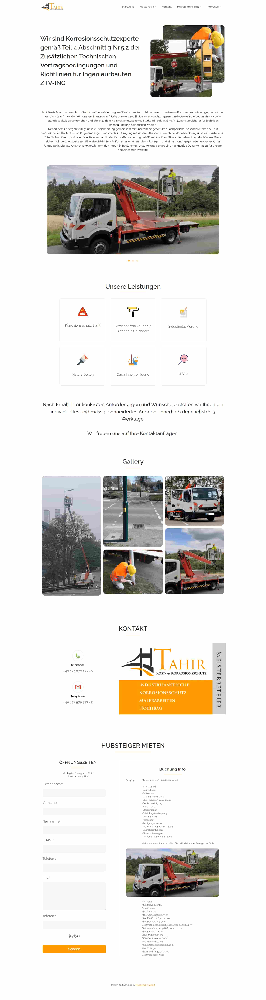

### `Tahir-Lacke Master-Company -` [Live Link](https://tahir-lacke.netlify.app/).

<p align="center">
  <a href="https://tahir-lacke.netlify.app/">
    
  </a>
</p>
<h1 align="center">
  Tahir Lacke
</h1>
<p align="center">
  Built using <a href="https://reactjs.org/" target="_blank">React JS</a> and hosted on <a href="https://www.netlify.com/" target="_blank">Netlify</a>.
</p>



## 🚀 Installation

1.  Clone the repository and change directories

    ```shell
    git clone https://github.com/iftikharrasha/tahir-master-company-client-side.git
    cd tahir-master-company-client-side
    ```

2. Install dependencies

    ```shell
    npm install
    ```

3. Start the local server

    The site is now running at `http://localhost:3000`!
    

4.  **Open the source code and start editing!**


## What's inside? 🧐

A quick look at the top-level files hierarchy.

```sh
  .
  ├── node_modules
  ├── public 
  ├── src
      └── Components
          └── Contact
            ├── Contact.js
          └── Footer
            ├── Footer.js
          └── Gallery
            ├── Gallery.js
          └── Header
            ├── Header.js
          └── Hero
            ├── Hero.js
          └── HomeSlider
            ├── HomeSlider.js
          └── NotFound
            ├── NotFound.js
          └── Rent
            ├── Rent.js
          └── Services
            ├── Services.js
      └── Fonts
      └── Images
      └── Pages
      └── Sass
      ├── App.js
      ├── App.test.js
      ├── index.js
      ├── logo.svg
      ├── reportWebVitals.js
      ├── setupTests.js
  ├── .gitignore
  ├── package-lock.json
  ├── package.json
  ├── README.md
 ```
 
 ## 🎨 Color Reference
| Color          | Hex                                                                |
| -------------- | ------------------------------------------------------------------ |
| White          |  `#ffffff` |
| Orange        |  `#FF9900` |
| Primary        |  `#313131` |
| Accent        |  `#707070` |
| Secondary        |  `#202020` |


